= Rebrickable Refined
:toc-title:
:toc:

=== Browser extension that enhances https://rebrickable.com/[rebrickable.com] with new features and fixes some annoyances

"Rebrickable Refined" is a browser extension is meant to improve your experience of using https://rebrickable.com/[rebrickable.com]. It is *not affiliated* with https://rebrickable.com/[rebrickable.com]

The features are all something that I personally wish was part of the main website. I spent a lot of time developing them for myself, so I can only hope these improvements will reach as many people as possible.

You can see all the features described below. +
Per your preference, they can all be individually enabled or disabled in the Settings screen (click on the extension's icon in the toolbar). But in my personal opinion, all of them are good to enable -- it should be rare for any of the features to disrupt your experience.

= Privacy

This extension never sends your data elsewhere *other than the following exceptions* where it uses *external services*:

* For the features "Add an improved parts search function..." and "Replace the parts search function...":
+
It sends the search queries that you type into the search field to the external https://setmaster.pryp.in/["SetMaster"] service, so that the service can return the search results for that query. Only the exact search query that you typed is sent. This external service is owned by me. It stores access logs (which include all incoming queries) for up to 3 months. (See https://setmaster.pryp.in/privacy/[full privacy policy])

** As such, the "Replace the parts search function" setting is disabled by default, you should enable it in Settings.
** Note that the "Add an improved parts search function" setting is *enabled* by default, but it only adds a new menu item, so no data can be sent until you choose the "Parts+" menu item.

* For the feature "Show additional related parts...":
+
It periodically downloads part definition updates from a static page hosted on GitHub. (No data is sent.)

All external-facing features (present and future) will be described in this section. They will also always require some kind of opt-in to use.

= Features

== Part lists

[#fix-parts-sort-order]
=== Fix the sort order of parts

Rebrickable sorts parts in a confusing way - numbers can go like "1, 10, 12, 2, 3, 4..." rather than "1, 2, 3, 4, 10, 12". +
This fixes the problem with sorting. Example:

[frame=none,cols="a,a"]
|===
|Before: +
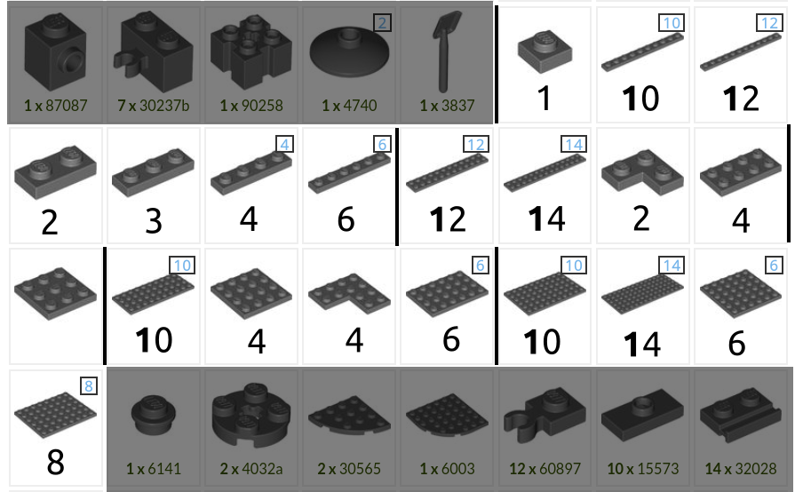
|After: +
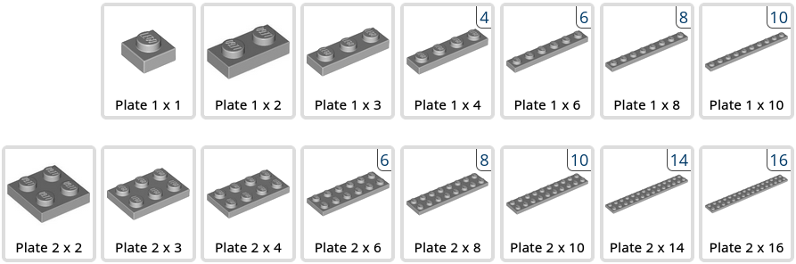
|===

https://forum.rebrickable.com/t/fix-the-parts-sort-order-number-10-should-not-come-directly-after-1/170763[(Corresponding forum post)]

Additional fixes:

* When sorting by Hue, "Red" and "Trans-Red" will no longer be arbirarily mixed with each other just because they have the same hue.
* When sorting by Category, the sort order used to be "by Category, then by Color" which makes little sense. Change it to "by Category, then by Part, then by Hue"

// The sorting fixes can also apply in other areas of the website but there is no known effect of this.

[#rework-inventory-styles]
=== Rework part list styles

The styles of part lists (inventories) are changed to look nicer and with better clarity. +
In particular, the part length indicators in the corner are redesigned to be more subtle and in a way that they can't be confused with the part count.

[frame=none,cols="a,a"]
|===
|Before: +
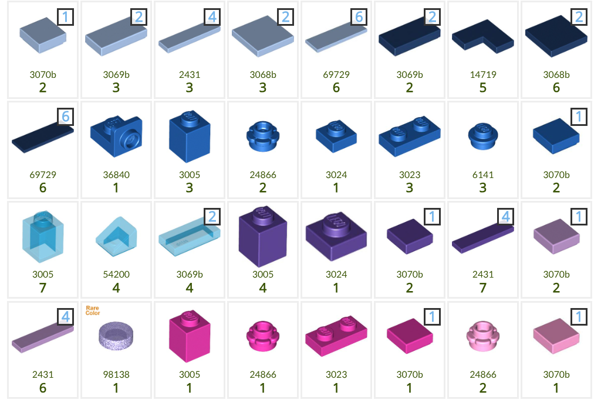
|After: +
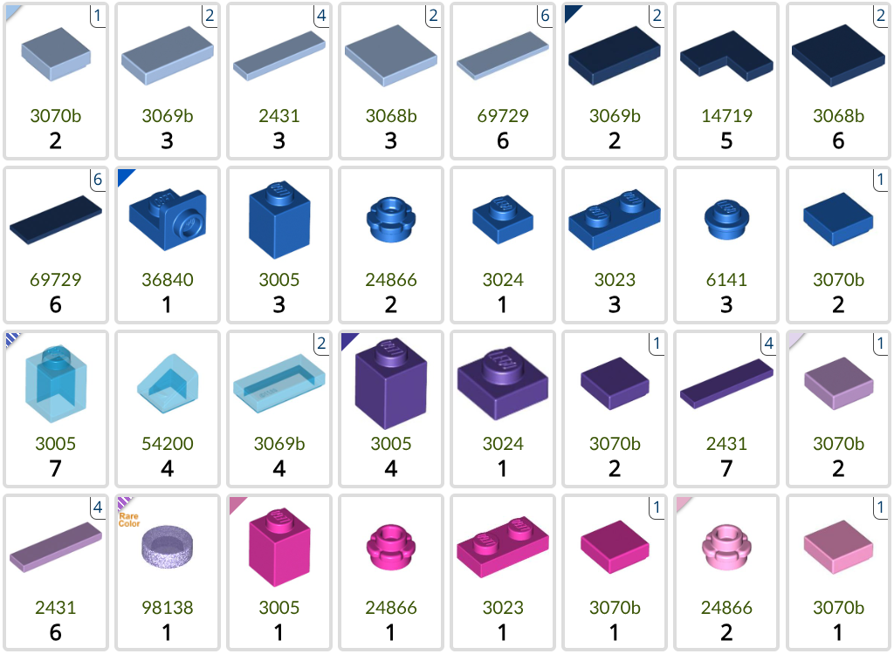
|===

[#decorate-part-colors]
=== Add colored corners to part tiles to disambiguate the color

When sorting by Hue or Color, the first piece in each color gets a colored corner swatch in the top-left. +
See previous screenshot -- these corners can be disabled if desired.

[#consistent-part-images]
=== Make part images consistent, fix brightness of black parts

The images of parts on Rebrickable can have varying styles and varying levels of brightness for the same color. This brings them back to a consistent look.

[frame=none,cols="a,a"]
|===
|Before: +
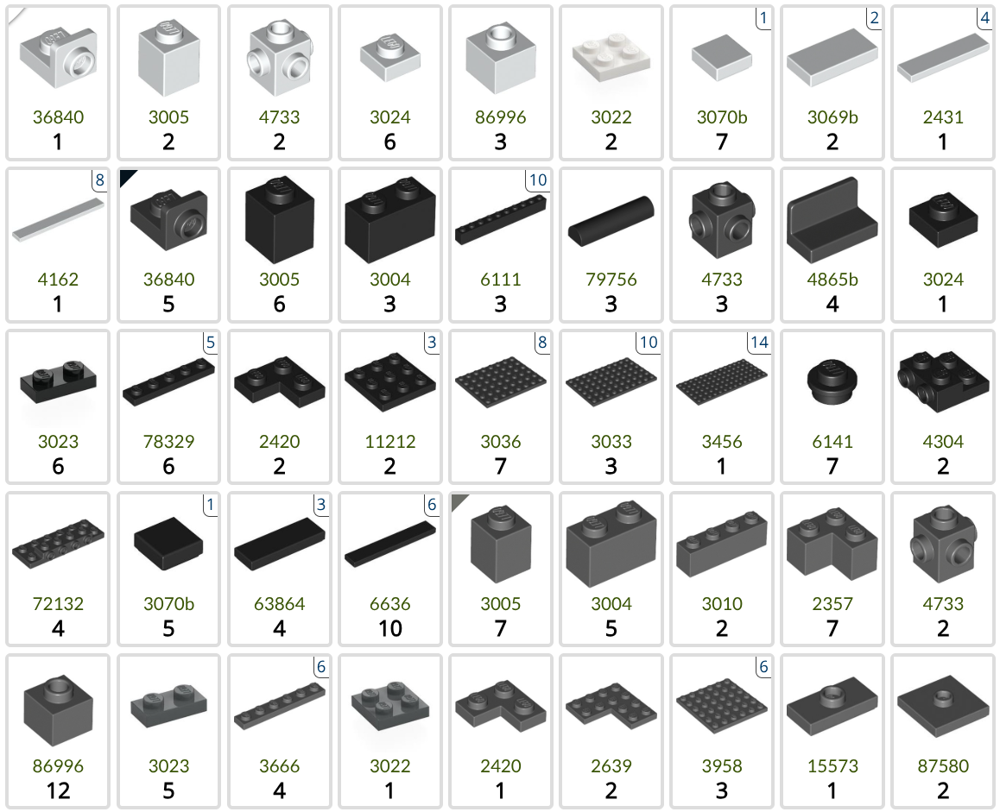
|After: +
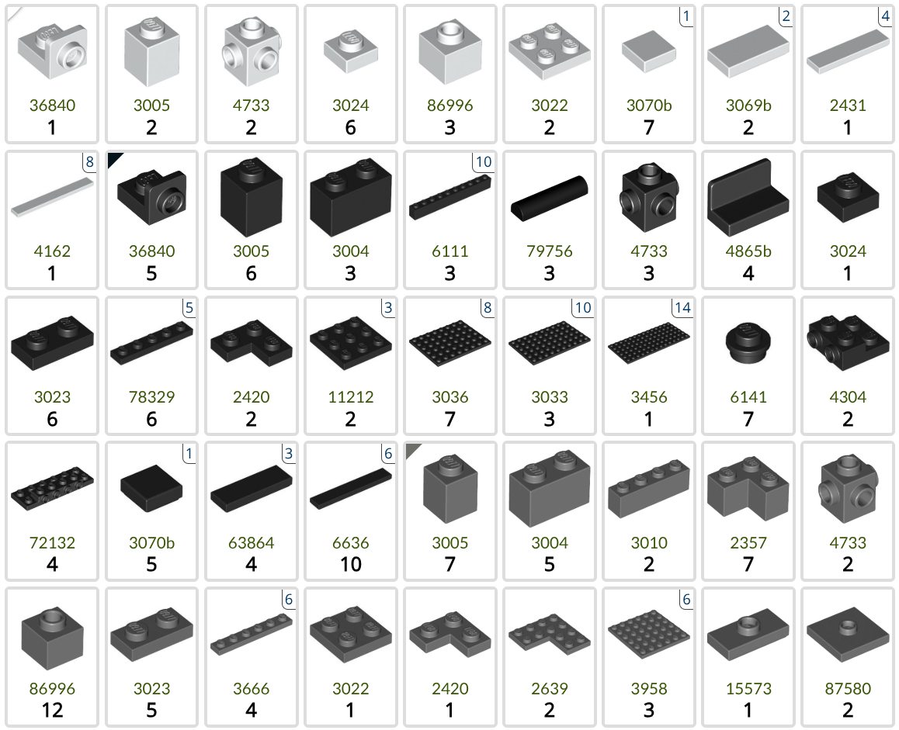
|===

https://forum.rebrickable.com/t/parts-in-black-have-varying-brightness-sometimes-too-similar-to-dark-bluish-gray/171452/33[(Corresponding forum  post)]

[#checklist-range-selection]
=== Enable range selection in part lists (Click, then Shift+Click)

In Checklist mode, you can easily select a range of parts by clicking the first part and Shift+clicking the last part of the range.

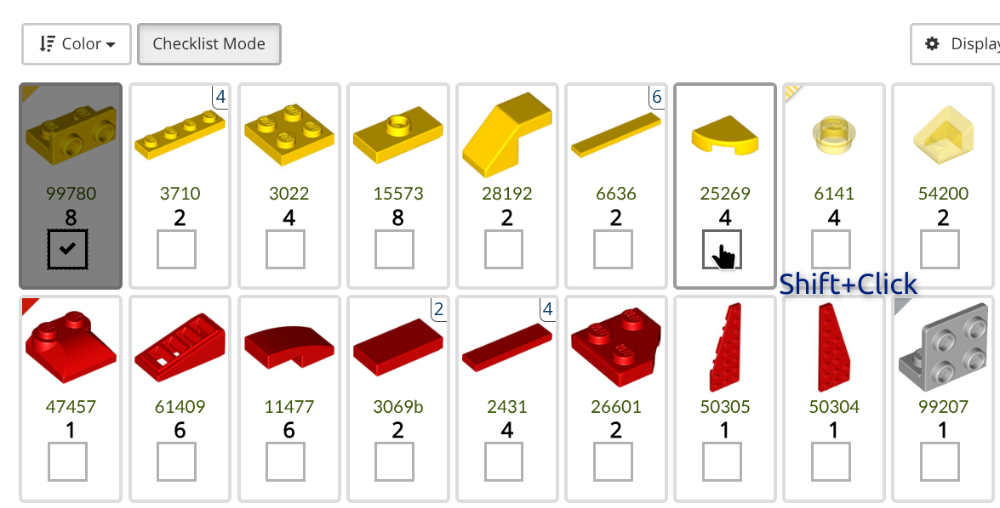

== Part details pages

[#display-related-parts]
=== Show additional related parts, add detailed tables where applicable

On a part's details page, add a new section with a wide selection of parts you might be interested in navigating to. +
link:src/related-parts-data.ts[The data source] can be expanded as more ideas about related parts arise.

[frame=none,cols="a,a"]
|===
|image::docs/display-related-parts.png[]
|image::docs/display-related-parts-table.png[]
|===

[#fix-part-retirement-years]
=== Display corrected part retirement years if they are known to be wrong

For some of the parts, the retirement years sometimes get bumped to a much later time period just because 1 set has wrongly documented parts. Because it is very hard to prove those corrections, we can instead just directly cross out the wrong year and replace it with a more reasonable one.

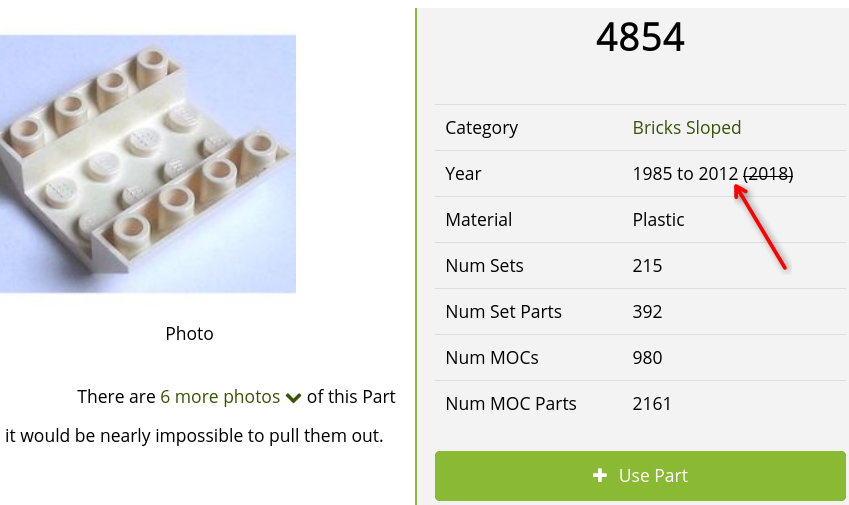

[#owned-parts-headings]
=== Your Colors: Add textual headings to the table of your owned colors of parts

Add rotated column headings that name each color, as seen at the top of this screenshot:

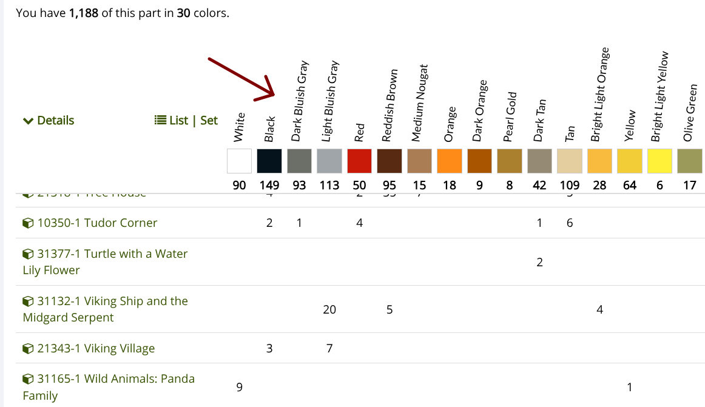

[#partlists-first-in-owned-parts]
=== Your Colors: Show partlists first

The Your Colors table (see previous screenshot) always shows sets first. This swaps them and instead shows part lists first. Also, part list names are now correctly alphabetically sorted.

== Main search field

[#add-main-parts-search]
=== Add an improved parts search function to the main search field ("Parts+")

[frame=none,cols="a,a"]
|===
|Before: +
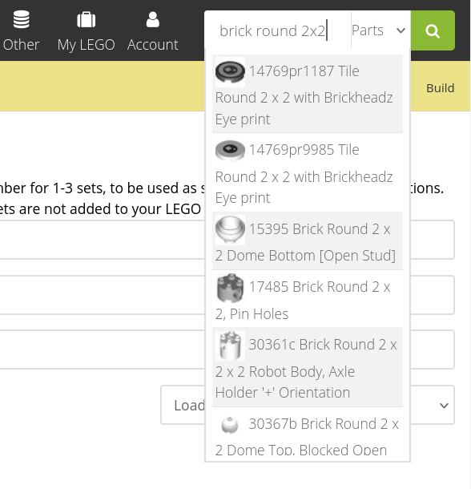
|After: +
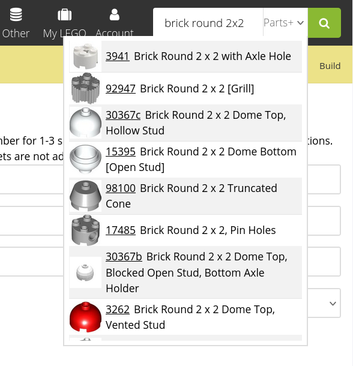
|===

This is completely new search functionality based on an external service that I've built.

* The search favors precise matches of whole words and phrases.
* It tends to show most common parts first. Due to this, printed parts don't clutter the search.
* Some fuzzy search ability is still present, in particular it knows about plurals and many synonyms. Some slang keywords like "SNOT" are supported.
* It has specific understanding of dimensions like "2x1" so that it also finds parts that have "1x2" or "1x2x5".
* It directly downranks "Duplo", "Quatro", "Primo" and "Modulex" parts unless that word is explicitly mentioned. Similarly for stickers and cards.

This functionality concerns only searching of *parts*. +
It is activated only when you select the new "Parts+" dropdown item instead of the old "Parts" item.

[#focus-main-parts-search]
=== Always pre-select the new search function when viewing any parts-related page

When visiting parts search or a part's details page, the top-right global Search field will always have "Parts+" selected by default.

[#remember-selected-search-option]
=== Remember the selected search category across page visits

When you make a new selection in the top-right global Search field, the selection is remembered across pages.

== Part details and search

[#part-dialog-replace-search]
=== Replace the parts search function in the "Part Summary" and "Add Part" dialogs

The same new search functionality (described in detail above) can also be applied to part details dialogs.

Additionally, after you've clicked a search result, the part is displayed right under the input field to give you better confidence about your input.

[frame=none,cols="a,a"]
|===
|Before: +
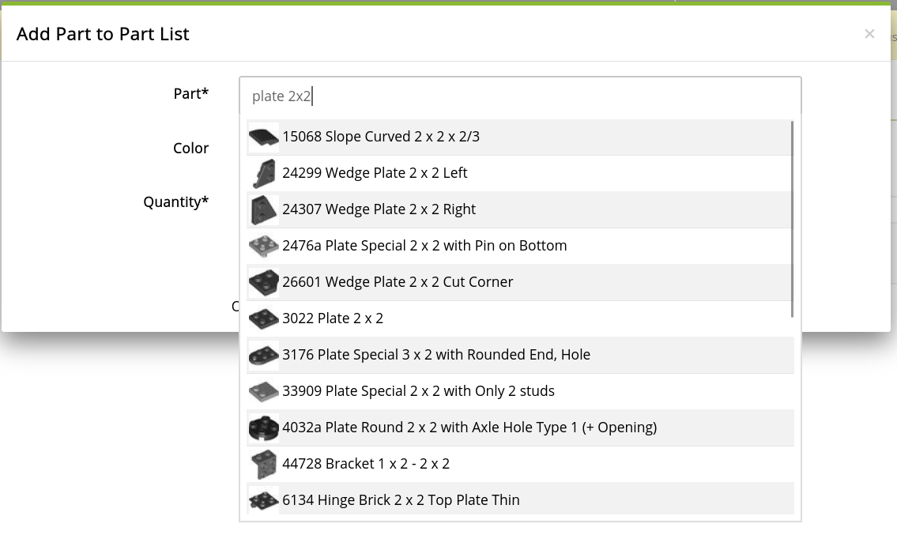
|After: +
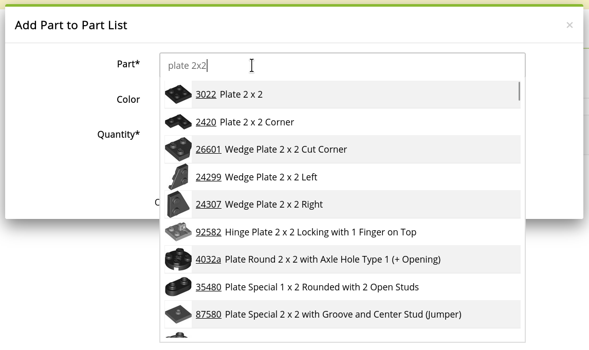
|===

[#part-dialog-filter-existing-colors]
=== Filter selectable part colors to only the existing ones in the "Add Part" dialog

When adding a new part, you first find the correct part and then select its color. The color selection normally shows all colors. This changes that - now the colors are limited to only the existing colors of the part that you just found in the search results.

[frame=none,cols="a,a"]
|===
|Before: +
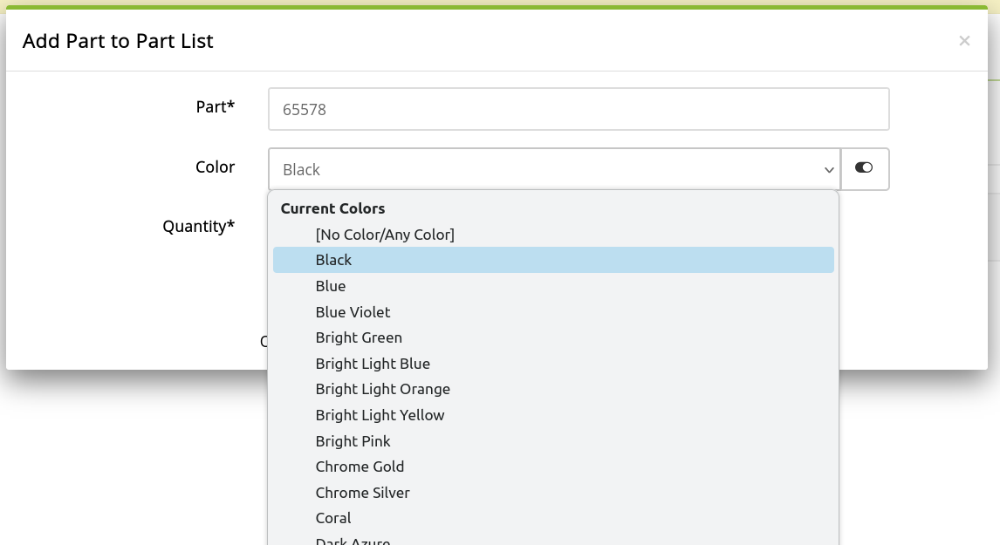
|After: +
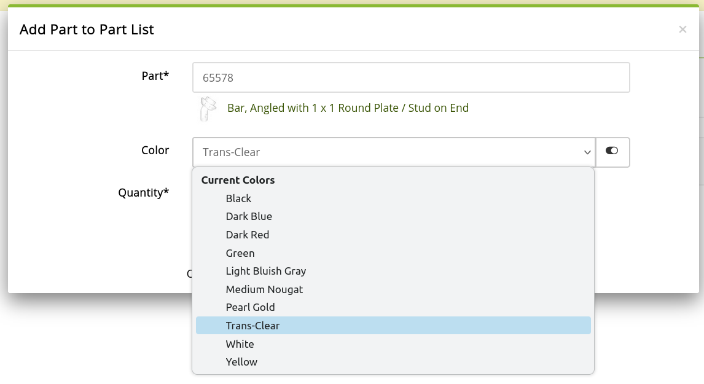
|===

[#part-dialog-always-sort-colors]
=== Always sort the color dropdown alphabetically in the "Use Part" dialog

When clicking on a part in order add it to another list, the color dropdown is sorted by how often that color occurs. For better "muscle memory", now we always sort the colors alphabetically instead.

[#part-dialog-improved-keyboard-input]
=== Improved keyboard input in the "Add Part" dialog

// TODO

== Set / MOC details

[#redesign-set-and-moc-tiles]
=== Redesign set and MOC tiles: show likes, release dates, part counts

For MOCs: Always show the number of likes, part counts and release dates on each MOC's tile. +
Apply a new label "Alt+" when the MOC is an alternate build made from _multiple_ sets.

For sets:  Always show the set number, part count and release year.

[frame=none,cols="a,a"]
|===
|image::docs/redesign-moc-tiles.png[]
|image::docs/redesign-set-tiles.png[]
|===

[#detailed-moc-sidebar]
=== Show more details on the sidebar of a MOC

When viewing a MOC's page, show the number of likes, part count and release date prominently in the top-right sidebar.

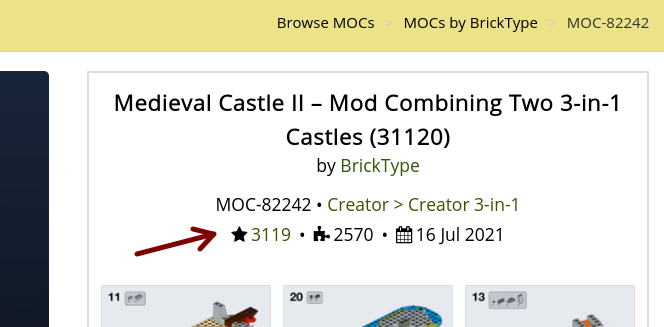

[#quick-download-csv-link]
=== Add a quick download link for the CSV parts list in the sidebar of a MOC

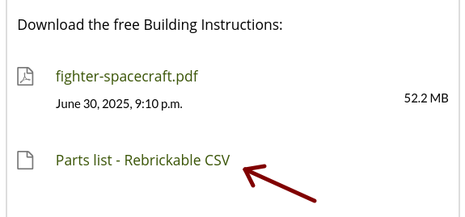

== General

[#increase-image-resolution]
=== Increase resolution for most thumbnail images, so they are not blurry

[frame=none,cols="a,a"]
|===
|Before: +
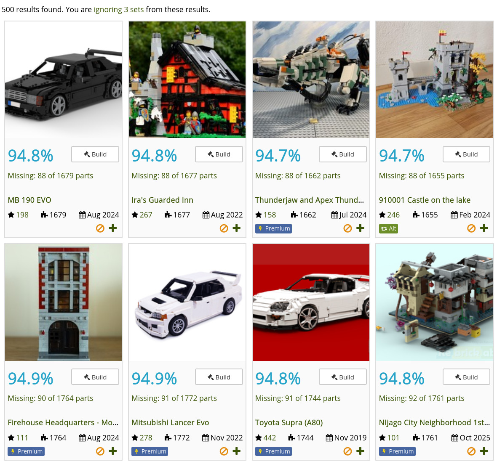
|After: +
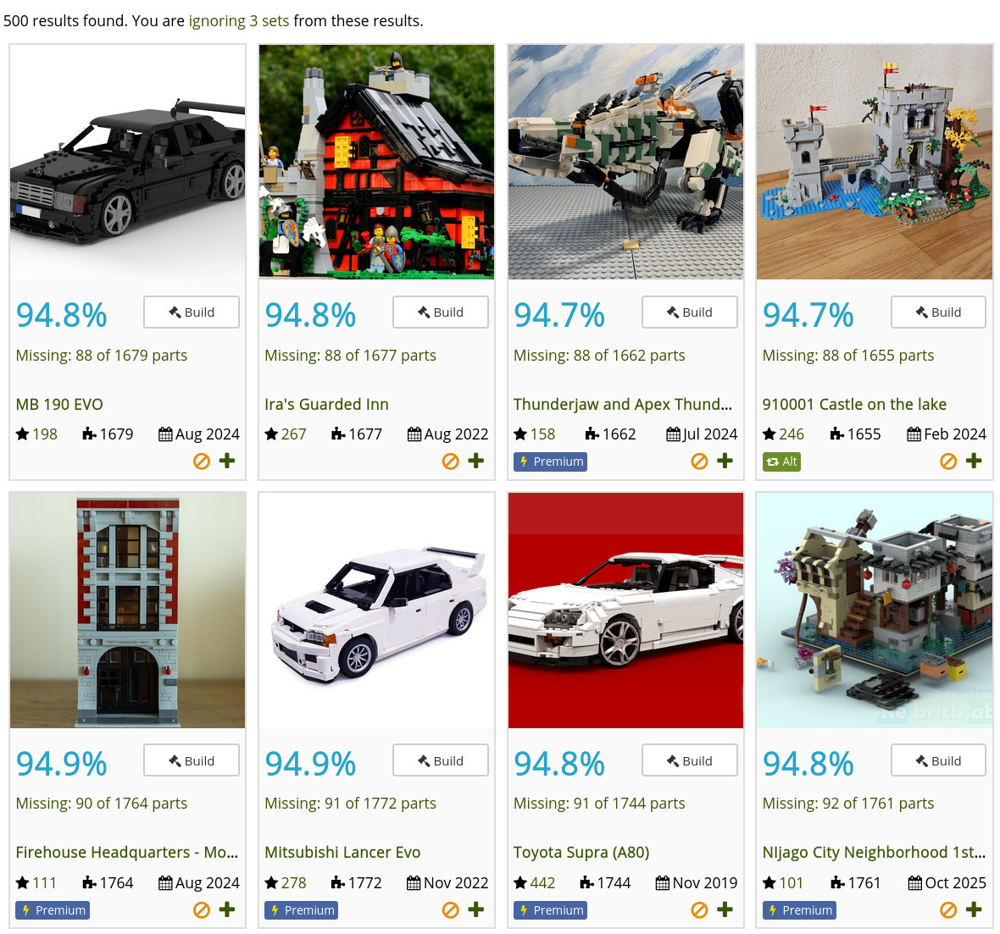
|===

[#enable-high-contrast-text]
=== Enable the built-in "high contrast text" setting

The "High Contrast Text" setting of Rebrickable is very nice to enable, so I really hope to spread the word about it in this way. We forcibly enable it and also fix up a few further places where high contrast should have been applied.

= Author

This extension is developed by http://pryp.in/[Oleh Prypin].

It has no affiliation with Rebrickable. And it has no affiliation with my employer.

This extension is provided totally free of charge. +
Please support its continued maintenance by donating to the author: +
https://github.com/sponsors/oprypin[*GitHub sponsors page of @oprypin*]

= Contact

Bug reports and suggestions are welcome. +
Please open an issue at https://github.com/oprypin/rebrickable-refined/issues

= License

Copyright (C) 2026 Oleh Prypin

This program is free software: you can redistribute it and/or modify it under the terms of the GNU Affero General Public License as published by the Free Software Foundation, either version 3 of the License, or (at your option) any later version.

This program is distributed in the hope that it will be useful, but WITHOUT ANY WARRANTY; without even the implied warranty of MERCHANTABILITY or FITNESS FOR A PARTICULAR PURPOSE. See the GNU Affero General Public License for more details.

You should have received a copy of the GNU Affero General Public License along with this program. If not, see <https://www.gnu.org/licenses/>.
